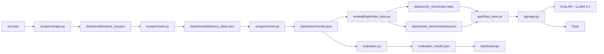
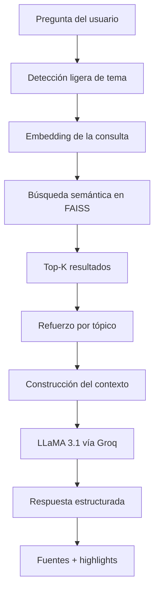

# ChatBot CRAI UAO · RAG Pipeline · FAISS · Flask · Streamlit

[](https://www.python.org/)
[](https://flask.palletsprojects.com/)
[](https://faiss.ai/)
[](https://console.groq.com/)
[](https://streamlit.io/)
[](https://www.sbert.net/)

**ChatBot CRAI UAO** es un sistema conversacional basado en RAG (Retrieval-Augmented Generation) para el Centro de Recursos para el Aprendizaje y la Investigación de la Universidad Autónoma de Occidente. El sistema extrae contenido real del CRAI, lo limpia, lo fragmenta en chunks, genera embeddings multilingües, indexa en FAISS y responde preguntas usando únicamente el contexto recuperado [web:953][file:520].

> El modelo no responde con conocimiento propio: recupera fragmentos reales de las fuentes del CRAI y los usa como contexto para generar respuestas trazables y controladas [file:520].

**Equipo:** Equipo NovIA

---

## Tabla de contenidos

- [Objetivo](#objetivo)
- [Funcionalidades](#funcionalidades)
- [Arquitectura](#arquitectura)
- [Base de conocimiento](#base-de-conocimiento)
- [Evaluación](#evaluación)
- [Instalación y uso](#instalación-y-uso)
- [Estructura del proyecto](#estructura-del-proyecto)
- [API](#api)
- [Modelo y retrieval](#modelo-y-retrieval)
- [Dashboard](#dashboard)
- [Troubleshooting](#troubleshooting)
- [Equipo](#equipo)

---

## Objetivo

- Responder preguntas sobre servicios, reglamentos, recursos y espacios del CRAI usando información real y verificable.
- Construir un pipeline RAG completo: scraping, limpieza, chunking, embeddings, indexación, retrieval y generación.
- Garantizar trazabilidad mostrando fragmentos y fuentes usadas en cada respuesta.
- Reducir alucinaciones haciendo que el LLM responda solo con el contexto recuperado [file:520].

---

## Funcionalidades

- Scraping semántico por secciones `h1/h2/h3` de páginas del CRAI.
- Limpieza y filtrado de ruido sobre el corpus crudo.
- Generación de chunks con metadatos completos.
- Embeddings con `sentence-transformers/paraphrase-multilingual-MiniLM-L12-v2`, modelo multilingüe de 384 dimensiones para búsqueda semántica [web:953][web:987].
- Indexación vectorial con FAISS para retrieval semántico.
- Refuerzo ligero por tópico detectado al reordenar resultados recuperados.
- Historial multi-turn en la conversación.
- Respuestas controladas vía prompt para reducir alucinaciones.
- Dashboard Streamlit con corpus, fuentes y métricas de evaluación.
- Script `run.ps1` para orquestar pipeline, evaluación y arranque de servicios [cite:1].

---

## Arquitectura

### Flujo de datos



### Pipeline RAG



---

## Base de conocimiento

### Fuentes

Las fuentes se definen en `data/urls.json` junto con su tema y estabilidad. El corpus final depende del scraping y puede variar si una fuente cambia o no produce contenido útil en una ejecución determinada [file:520].

### Estructura de un chunk

| Campo | Tipo | Descripción |
|---|---|---|
| `id` | string | Identificador único del chunk |
| `doc_id` | string | Documento de origen |
| `title` | string | Título de la fuente |
| `section` | string | Encabezado de la sección |
| `source` | string | URL de origen |
| `topic` | string | Categoría temática |
| `stability` | string | Estabilidad de la fuente |
| `review_date` | string | Fecha de revisión |
| `chunk` | string | Texto del fragmento |
| `chunk_length_tokens` | int | Longitud aproximada en tokens |
| `embedding_text` | string | Texto enriquecido usado para embeddings |

---

## Evaluación

El proyecto incluye una evaluación básica del **retrieval** usando preguntas de prueba y métricas de ranking exportadas a `evaluation_results.json` y `resultados_evaluacion.csv` [cite:1].

### Métricas actuales

- **Hit@5**: indica si al menos un resultado relevante aparece en el top 5 [web:1120].
- **Precision@5**: proporción de resultados relevantes dentro de los 5 recuperados [web:1118].
- **Recall@5**: proporción estimada de información relevante recuperada en el top 5 [web:1127].
- **MRR**: mide qué tan arriba aparece el primer resultado relevante [web:1119][web:1122].
- **Latencia**: tiempo de recuperación por consulta [cite:1].

### Salidas de evaluación

- `resultados_evaluacion.csv`
- `evaluation_results.json`

Estas salidas son consumidas por el dashboard para mostrar KPIs, tablas y gráficas de desempeño del retrieval [cite:1].

---

## Instalación y uso

### 1. Clonar el proyecto

```bash
git clone https://github.com/ShadowBlack33/ChatBot-UAO.git
cd ChatBot-UAO
```

### 2. Crear entorno virtual

```bash
python -m venv venv
```

**Windows**
```bash
venv\Scripts\activate
```

**macOS / Linux**
```bash
source venv/bin/activate
```

### 3. Instalar dependencias

```bash
pip install -r requirements.txt
```

### 4. Configurar API key

Crear un archivo `.env` en la raíz del proyecto:

```env
GROQ_API_KEY=gsk_tu_api_key_aqui
```

### 5. Ejecutar pipeline manual

```bash
python scraper/scrape.py
python scraper/clean.py
python scraper/chunk.py
python embeddings/index_faiss.py
python evaluation.py
python -m app.app
```

### 6. Ejecutar dashboard

```bash
python -m streamlit run dashboard.py
```

### 7. Ejecución orquestada en Windows

```powershell
.\run.ps1
```

El script ejecuta scraping, limpieza, chunking, indexación FAISS, evaluación y luego levanta Flask y Streamlit [cite:1].

---

## Estructura del proyecto

```text
ChatBot-UAO/
├── .env
├── .gitignore
├── README.md
├── requirements.txt
├── run.ps1
├── dashboard.py
├── evaluation.py
├── evaluation_results.json
├── resultados_evaluacion.csv
├── data/
│   ├── urls.json
│   ├── raw/
│   │   └── biblioteca_raw.json
│   ├── clean/
│   │   ├── biblioteca_clean.json
│   │   └── chunks.json
│   └── vector_store/
│       ├── index.faiss
│       └── metadata.json
├── scraper/
│   ├── scrape.py
│   ├── clean.py
│   └── chunk.py
├── embeddings/
│   └── index_faiss.py
└── app/
    ├── __init__.py
    ├── app.py
    ├── faiss_store.py
    ├── templates/
    │   └── index.html
    └── static/
        └── style.css
```

---

## API

| Método | Endpoint | Descripción |
|---|---|---|
| `GET` | `/` | Interfaz del chatbot |
| `POST` | `/ask` | Recibe una pregunta y responde con RAG |
| `POST` | `/reset` | Reinicia el historial conversacional |
| `GET` | `/stats` | Devuelve estadísticas del corpus indexado |

### Ejemplo de `/ask`

```json
{
  "status": "ok",
  "answer": "El CRAI ofrece servicios de préstamo, capacitación y acceso a recursos digitales.",
  "highlights": [
    {
      "section": "Servicios",
      "text": "El CRAI ofrece préstamo, recursos digitales y espacios de estudio...",
      "topic": "servicios",
      "stability": "alta"
    }
  ],
  "sources": [
    {
      "title": "Servicios del CRAI",
      "url": "https://www.uao.edu.co/...",
      "topic": "servicios",
      "stability": "alta"
    }
  ],
  "timestamp": "14:32",
  "topic": "servicios",
  "chunks_used": 5,
  "retrieval_info": "Se usaron 5 fragmentos del CRAI como contexto."
}
```

---

## Modelo y retrieval

### Generación

| Parámetro | Valor |
|---|---|
| Modelo | `llama-3.1-8b-instant` |
| Temperature | `0.2` |
| Max tokens | `600` |
| Historial | Últimos 6 mensajes |

### Embeddings

| Parámetro | Valor |
|---|---|
| Modelo | `sentence-transformers/paraphrase-multilingual-MiniLM-L12-v2` |
| Tipo | Multilingüe |
| Dimensión | 384  |
| Max sequence length | 128 tokens |

El modelo de embeddings soporta múltiples idiomas y está pensado para tareas de búsqueda semántica y clustering [web:953][web:987].

---

## Dashboard

El dashboard en Streamlit permite visualizar:

- métricas generales del corpus,
- distribución de chunks por tema y estabilidad,
- relación entre fuentes y chunks generados,
- explorador de chunks,
- y métricas de evaluación del retrieval tomadas desde `evaluation_results.json` [cite:1].

Ejecutar con:

```bash
python -m streamlit run dashboard.py
```

---

## Troubleshooting

| Problema | Solución |
|---|---|
| `run.ps1` no se ejecuta | Ejecutar `Unblock-File -Path .\run.ps1` en PowerShell |
| `No module named 'app.faiss_store'` | Ejecutar Flask con `python -m app.app` |
| `chunks.json` no existe | Ejecutar `scrape.py`, `clean.py` y `chunk.py` |
| `index.faiss` o `metadata.json` no existen | Ejecutar `python embeddings/index_faiss.py` |
| `evaluation_results.json` no existe | Ejecutar `python evaluation.py` |
| Error de API key | Verificar `.env` y `GROQ_API_KEY` |
| LibGuides devuelve 0 secciones | La página carga contenido dinámico y puede requerir Playwright o Selenium [file:520] |
| Streamlit no toma el venv | Ejecutar `python -m streamlit run dashboard.py` dentro del entorno virtual [web:1147] |

---

## Equipo

**Equipo NovIA** · Universidad Autónoma de Occidente

| Integrante | Rol |
|---|---|
| Carlos Andrés Orozco Caicedo | Scraping, pipeline de datos, backend e interfaz |
| Esteban Cobo Gómez | Scraping, pipeline de datos, backend e interfaz |
| Sara Lucía Rojas Mejía | Integración LLM y extensión del sistema |
| José David Mesa Ramírez | Integración LLM y extensión del sistema |

> Prototipo académico desarrollado para el CRAI UAO · 2026
