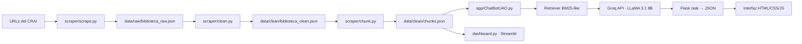
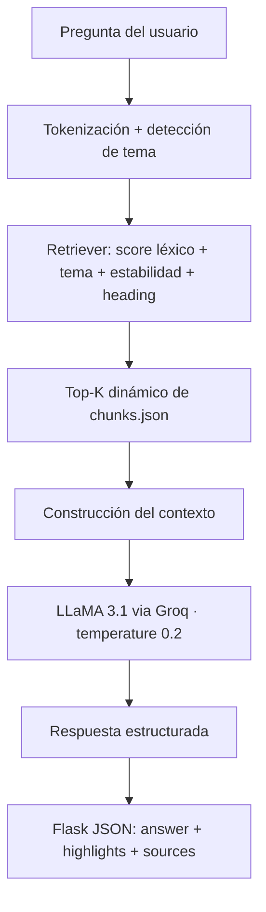

# 🤖 ChatBot CRAI UAO · RAG Pipeline → Flask → Streamlit

[](https://www.python.org/)
[](https://flask.palletsprojects.com/)
[](https://console.groq.com/)
[](https://streamlit.io/)
[](https://www.crummy.com/software/BeautifulSoup/)

**ChatBot CRAI UAO** es un sistema conversacional de extremo a extremo basado en RAG (Retrieval-Augmented Generation) para el Centro de Recursos para el Aprendizaje y la Investigación de la Universidad Autónoma de Occidente, Cali, Colombia.

> El modelo **no responde con conocimiento propio** — recupera fragmentos reales de las fuentes del CRAI y los usa como contexto para generar respuestas precisas y trazables.
>
> **Equipo:** Equipo NovIA 🇨🇴

---

## 🧭 Tabla de contenidos

- [🎯 Objetivo](#-objetivo)
- [✨ Funcionalidades](#-funcionalidades)
- [🏗️ Arquitectura](#-arquitectura)
- [📚 Base de conocimiento](#-base-de-conocimiento)
- [⚙️ Instalación y uso](#-instalación-y-uso)
- [🗂️ Estructura del proyecto](#-estructura-del-proyecto)
- [🔌 API Endpoints](#-api-endpoints)
- [⚙️ Configuración del modelo](#-configuración-del-modelo)
- [🖥️ Dashboard](#-dashboard)
- [🛠️ Troubleshooting](#-troubleshooting)
- [👥 Equipo](#-equipo)

---

## 🎯 Objetivo

- Responder preguntas sobre servicios, recursos, reglamentos y espacios del CRAI usando información real y verificable.
- Construir un pipeline RAG completo: scraping → limpieza → chunking → retrieval → generación.
- Garantizar trazabilidad: cada respuesta expone los fragmentos fuente utilizados.
- Evitar alucinaciones: el LLM responde **únicamente** con el contexto recuperado.

---

## ✨ Funcionalidades

- 🔍 **Scraping semántico** por secciones `h1/h2/h3` de las páginas del CRAI
- 🧹 **Pipeline de limpieza** con filtrado de ruido, deduplicación y normalización
- 📦 **Chunks con metadatos** (`topic`, `stability`, `section`, `source`, `review_date`)
- 🎯 **Retriever con puntuación compuesta**: coincidencia léxica + bonus por tema + estabilidad + heading
- 🔄 **Historial multi-turn** (últimos 6 mensajes / 3 turnos)
- 🚫 **Control de alucinaciones** en system prompt con temperatura `0.2`
- 💬 **Interfaz conversacional** estilo chat con fragmentos fuente colapsables
- 🌗 **Modo oscuro / claro** con toggle
- 📊 **Dashboard Streamlit** con estadísticas de la base de conocimiento
- 📱 **Responsive** para móvil

---

## 🏗️ Arquitectura

### 🔄 Flujo de datos



### 🧠 Pipeline RAG



---

## 📚 Base de conocimiento

### Fuentes indexadas

| Página | Tema | Estabilidad |
|---|---|---|
| CRAI — página principal | Información general | Media |
| Servicios del CRAI | Servicios | Alta |
| Recursos digitales | Recursos digitales | Media |
| Reglamento del CRAI | Reglamento | Alta |
| LibCal UAO | Reservas y horarios | Baja |
| LibGuides — Búsqueda Total | Búsqueda académica | Media |
| Catálogo OPAC | Catálogo y novedades | Baja |

> Las fuentes con estabilidad **baja** cambian con frecuencia. Se recomienda re-ejecutar el pipeline periódicamente.

### Estructura de un chunk

| Campo | Tipo | Descripción |
|---|---|---|
| `id` | string | Identificador único del fragmento |
| `chunk` | string | Texto del fragmento |
| `section` | string | Encabezado de sección de origen |
| `source` | string | URL de la fuente |
| `topic` | string | Categoría temática |
| `stability` | string | `alta` / `media` / `baja` |
| `review_date` | string | Fecha de revisión recomendada |

---

## ⚙️ Instalación y uso

```bash
# 1. Descomprimir o clonar el proyecto
cd "ChatBot UAO"

# 2. Crear entorno virtual
python -m venv venv

# Windows
venv\Scripts\activate

# macOS / Linux
source venv/bin/activate

# 3. Instalar dependencias
pip install -r requirements.txt

# 4. Configurar API key de Groq
# Crear cuenta gratuita en https://console.groq.com
# Crear archivo .env en la raíz:
echo GROQ_API_KEY=gsk_tuKeyAqui > .env
```

### Ejecutar el pipeline completo

```bash
# Paso 1 — Scraping
python scraper/scrape.py

# Paso 2 — Limpieza
python scraper/clean.py

# Paso 3 — Chunking
python scraper/chunk.py

# Paso 4 — Chatbot
python app/ChatBotUAO.py
```

Abrir en el navegador: **http://127.0.0.1:5000**

---

## 🗂️ Estructura del proyecto

```
ChatBot UAO/
│
├── .env                        ← API key (NO subir a GitHub)
├── .env.example                ← Plantilla del .env
├── .gitignore
├── requirements.txt
├── README.md
├── run.ps1                     ← Script de ejecución completa (Windows)
├── dashboard.py                ← Dashboard Streamlit
│
├── data/
│   ├── urls.json               ← URLs del CRAI con metadatos
│   ├── raw/
│   │   └── biblioteca_raw.json ← Generado por scrape.py
│   └── clean/
│       ├── biblioteca_clean.json
│       └── chunks.json         ← Base de conocimiento del RAG
│
├── scraper/
│   ├── scrape.py               ← Extracción semántica por secciones
│   ├── clean.py                ← Limpieza, filtrado y deduplicación
│   └── chunk.py                ← Generación de chunks con metadatos
│
└── app/
    ├── ChatBotUAO.py           ← Backend Flask + retriever + Groq
    ├── templates/
    │   └── index.html          ← Interfaz conversacional
    └── static/
        └── style.css           ← Estilos (modo oscuro, responsive)
```

---

## 🔌 API Endpoints

| Método | Endpoint | Descripción |
|---|---|---|
| `GET` | `/` | Interfaz del chatbot |
| `POST` | `/ask` | Recibe `{"question": "..."}` → respuesta RAG |
| `POST` | `/reset` | Limpia el historial de sesión |
| `GET` | `/stats` | Estadísticas de la base de conocimiento |

### Ejemplo de respuesta `/ask`

```json
{
  "status": "ok",
  "answer": "El CRAI ofrece servicios de préstamo, capacitación...",
  "highlights": [
    {
      "section": "ESPACIOS FÍSICOS",
      "text": "Sala de capacitación con 30 puestos...",
      "topic": "servicios",
      "stability": "alta"
    }
  ],
  "sources": [
    {
      "title": "Servicios del CRAI",
      "url": "https://...",
      "topic": "servicios",
      "stability": "alta"
    }
  ],
  "timestamp": "14:32",
  "topic": "servicios",
  "chunks_used": 5,
  "retrieval_info": "Se usaron 5 fragmentos del CRAI como contexto."
}
```

---

## ⚙️ Configuración del modelo

| Parámetro | Valor | Descripción |
|---|---|---|
| `model` | `llama-3.1-8b-instant` | Modelo rápido para prototipo |
| `temperature` | `0.2` | Respuestas precisas, baja creatividad |
| `max_tokens` | `600` | Límite de tokens por respuesta |
| `history` | Últimos 6 mensajes | Contexto conversacional multi-turn |

Para usar un modelo más potente, cambiar en `app/ChatBotUAO.py`:

```python
model="llama-3.3-70b-versatile"  # más inteligente, más lento
```

---

## 🖥️ Dashboard

```bash
streamlit run dashboard.py
```

Incluye:

- Total de chunks indexados
- Distribución por tema
- Fuentes activas en la base de conocimiento

---

## 🛠️ Troubleshooting

| Problema | Solución |
|---|---|
| `run.ps1` no se ejecuta | Correr `Unblock-File -Path .\run.ps1` en PowerShell |
| `chunks.json` no existe | Ejecutar el pipeline completo: `scrape.py → clean.py → chunk.py` |
| Error de API key | Verificar que `.env` existe y contiene `GROQ_API_KEY=gsk_...` |
| Chatbot responde "no encontré información" | Re-ejecutar el pipeline para actualizar las fuentes |
| LibGuides devuelve 0 secciones | Carga contenido con JS dinámico — requiere `selenium` o `playwright` |
| venv apunta a carpeta incorrecta | Borrar `venv/`, recrear con `python -m venv venv` y reinstalar |

---

## 👥 Equipo

**Equipo NovIA** · Universidad Autónoma de Occidente 🇨🇴

| Integrante | Rol |
|---|---|
| Carlos Andrés Orozco Caicedo | Scraping, pipeline de datos, backend e interfaz |
| Esteban Cobo Gómez | Scraping, pipeline de datos, backend e interfaz |
| Sara Lucía Rojas Mejía | Integración LLM y extensión del sistema |
| José David Mesa Ramírez | Integración LLM y extensión del sistema |

> Prototipo académico desarrollado para el CRAI UAO · 2026
